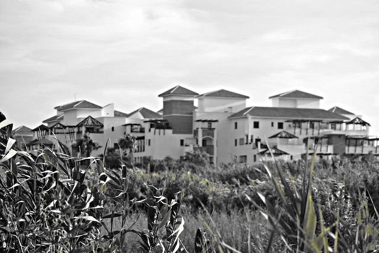
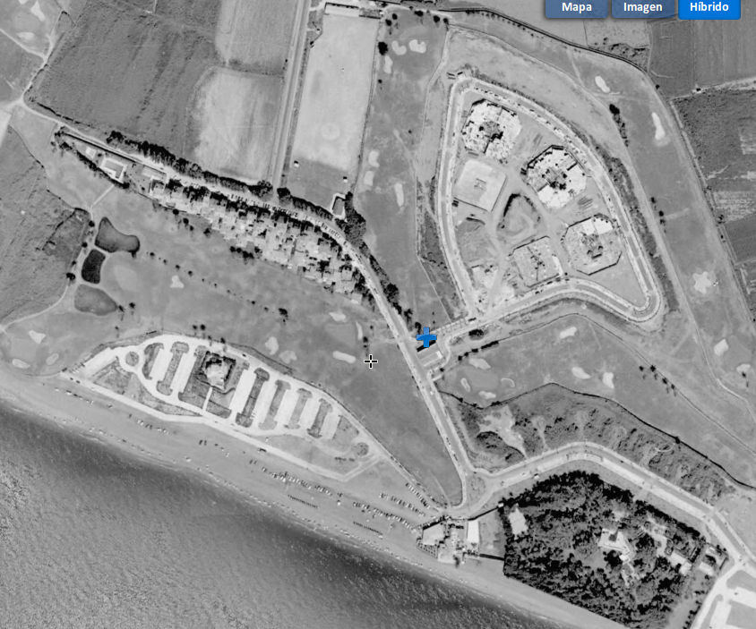

# Las Terrazas de Playa Granada

Los arquitectos hablan de [dialogar con el espacio](https://www.plataformaarquitectura.cl/cl/776632/150-palabras-o-expresiones-que-solo-usamos-los-arquitectos) cuando un proyecto es sensible a su contexto, a los otros edificios que hay alrededor y el espacio y luz que crean.

Cuando se construyó el Poblado del Chirimoyo, no había mucho que dialogar, se trataba más bien de un monólogo. Sin embargo, el contexto de Las Terrazas de Playa Granada era bastante diferente. El PGOU se publicó en 2002, y delimitaba no solo qué se podía construir, sino también cómo se podía construir. 

En ese momento, [según la web del ayuntamiento](http://www.motril.es/index.php?id=666), solo existía en Playa Granada el Poblado, Villa Astrida, y una residencia independiente (que posiblemente haya desaparecido), aparte de los equipamientos del campo de golf.

Realmente no es el primer bloque de viviendas que se construyó. En esa época, en 2003, ya estaba en construcción una serie de bloques más hacia el sur, en dirección a la orilla del mar, como revela la siguiente foto.

Es notable, sobre, todo, por ser el primer bloque de viviendas de cuya construcción se tiene cierta constancia y cuyo estudio de arquitectura se conoce. Se trata de [Gijón Arquitectura](http://www.gijonarquitectura.com/las_terrazas_de_playa_granada.html), un estudio dirigido por el arquitecto de Motril Ángel Gijón, que también ha construido otra serie de equipamientos y viviendas, sobre todo en Motril y la provincia de Granada.

Y mientras que el Poblado de Chirimoyo se hizo más o menos como el constructor y el arquitecto deseó, en este caso ya había *contexto* y, sobre todo, restricciones del plan urbanístico: la principal, que en altura se podía ocupar solo el 60% de la parcela. De la necesidad se hizo virtud, y se construyeron una serie de terrazas a diferente altura que le dan cierto dinamismo y que también permiten aprovechar la luz de Playa Granada, una luz mediterránea que es uno de los principales atractivos.

Pero volvemos al diálogo: construyéndose justamente al lado del poblado mediterráneo del chirimoyo, había que establecer una conversación arquitectónica que no lo dejara fuera y que tratara de "contestarle" sobre todo con el diseño, que no es compacto ni rectangular sino ligeramente piramidal, y un color terracota que no existe en muchos más lugares, pero sobre todo el color blanco, los balcones, algún arco de medio punto y las cubiertas de [teja árabe](https://es.wikipedia.org/wiki/Teja_%C3%A1rabe).

> Tradicionalmente, había fábricas de teja árabe en toda Andalucía y se usaba en todo tipo de construcciones, como la [fábrica Nuestra Señora de la Cabeza](https://guiadigital.iaph.es/bien/inmueble/29053/granada/motril/fabrica-nuestra-senora-de-la-cabeza) en Motril. Hoy en día, la teja árabe se vende hasta de segunda mano y solo quedan unos cuantos constructores artesanos.

Este respeto al entorno construido, aunque un poco sui géneris, va a brillar por su ausencia en casi todo el resto de Playa Granada. No hay más que ver los bloques que lo rodean.

O la misma [Villa Astrida](villa-astrida.md). 

## Referencias

* [En Plazatio](https://www.plazatio.com/es/proyecto/urbanizacion-las-terrazas-de-playa-granada-2)
* [En la web de Gijón Arquitectura](http://www.gijonarquitectura.com/las_terrazas_de_playa_granada.html)
