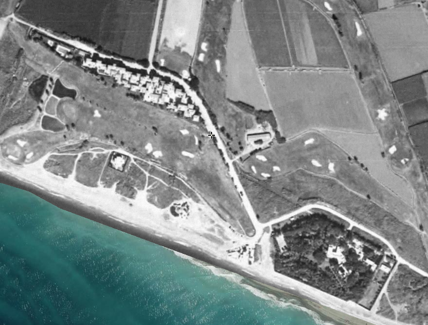

# Las Terrazas de Playa Granada

Los arquitectos hablan de [dialogar con el espacio](https://www.plataformaarquitectura.cl/cl/776632/150-palabras-o-expresiones-que-solo-usamos-los-arquitectos) cuando un proyecto es sensible a su contexto, a los otros edificios que hay alrededor y el espacio y luz que crean.

Cuando se construyó el Poblado del Chirimoyo, no había mucho que dialogar, se trataba más bien de un monólogo. Sin embargo, el contexto de Las Terrazas de Playa Granada era bastante diferente. El PGOU se publicó en 2002, y delimitaba no sólo qué se podía construir, sino también cómo se podía construir. 

En ese momento, [según la web del ayuntamiento](http://www.motril.es/index.php?id=666), sólo existía en Playa Granada el Poblado, Villa Astrida, y una residencia independiente (que posiblemente haya desaparecido), aparte de los equipamientos del campo de golf. 

## Referencias

* [En Plazatio](https://www.plazatio.com/es/proyecto/urbanizacion-las-terrazas-de-playa-granada-2)
* [En la web de Gijón Arquitectura](http://www.gijonarquitectura.com/las_terrazas_de_playa_granada.html)
